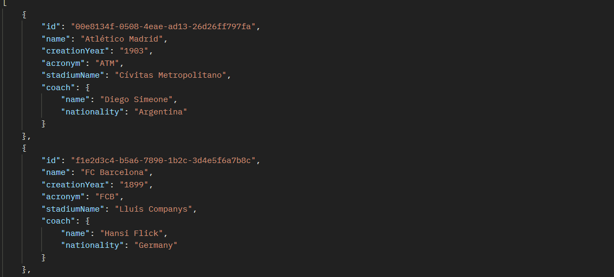

# European Football Championship Tracker – RESTful API System
A RESTful API backend system built with Spring Boot to help FIFA track and analyze club-level statistics across Europe’s five major football leagues (Premier League, La Liga, Bundesliga, Serie A, Ligue 1).
The solution is composed of a championship API per league: registers clubs, players, coaches, seasons, matches, and real-time statistics.

### Tech Stack :

Framework: Spring Boot

Database: PostgreSQL

API Design: OpenAPI 3 (YAML spec)

Testing: Postman, JUnit

### Key Features

- **Championship API :**
Manage clubs, players, and matches

Track player and club statistics per season (goals, minutes, clean sheets, etc.)

Auto-generate fixtures (home/away logic)

Real-time match status updates and point system (win = 3 pts, draw = 1 pt)
